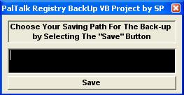



## PalTalk Registry Back Up

### Description

It Creates the Back Up for PalTalk Nicks

Just Before You're Going To Format Or Restore

Your PC, And It Also Very HelpFul , Before You Use Any Anti-Ban Program Or Getting Any Ban From

PalTalk.......

Have Fun......
 
### More Info
 

             |
---                |---
**Submitted On**   |2004-09-17 23:38:24
**By**             |[Salman Paji](https://github.com/Planet-Source-Code/PSCIndex/blob/master/ByAuthor/salman-paji.md)
**Level**          |Beginner
**User Rating**    |5.0 (15 globes from 3 users)
**Compatibility**  |VB 6\.0
**Category**       |[Registry](https://github.com/Planet-Source-Code/PSCIndex/blob/master/ByCategory/registry__1-36.md)
**World**          |[Visual Basic](https://github.com/Planet-Source-Code/PSCIndex/blob/master/ByWorld/visual-basic.md)
**Archive File**   |[PalTalk\_Re1795279172004\.zip](https://github.com/Planet-Source-Code/salman-paji-paltalk-registry-back-up__1-56242/archive/master.zip)

